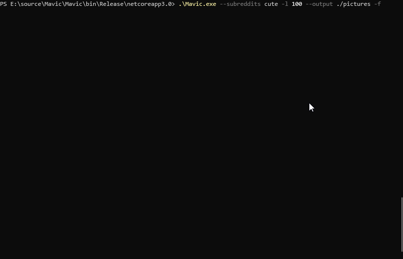

<h1 align="center">
    <a href="https://github.com/tehstun/Mavic">
      
    </a>
    <br/>
    <a href="https://github.com/tehstun/mavic">
      
    </a>
</h1>

<h4 align="center">Mavic is a CLI application designed to download direct images found on selected reddit
subreddits.</h4>

<p align="center">
  <a href="#how-to-use">How To Use</a> •
  <a href="#releases">Releases</a> •
  <a href="#license">License</a>
</p>

# How to Use

Display basic help related information about the application for when you quickly need to understand possible options.
Its important to note that all specified sub reddits come after the specified flags. Any before the specified flags will
be removed (mavic.exe flags subs - mavic.exe -o ./pictures cute pics)

```
.\mavic.exe --help

NAME:
   Mavic - .\mavic.exe -l 100 --output ./pictures -f cute pics memes

USAGE:
   mavic [global options] command [command options] [arguments...]

VERSION:
   0.2.0

DESCRIPTION:
   Mavic is a CLI application designed to download direct images found on selected reddit subreddits.

AUTHOR:
   Stephen Lineker-Miller <slinekermiller@gmail.com>

COMMANDS:
   help, h  Shows a list of commands or help for one command

GLOBAL OPTIONS:
   --output value, -o value           The output directory to store the images. (default: "./")
   --limit value, -l value            The total number of posts max per sub-reddit (default: 50)
   --frontpage, -f                    If the front page should be scrapped or not. (default: false)
   --type value, -t value             What kind of page type should reddit be during the scrapping process. e.g hot, new. top. (default: "hot")
   --root, -r                         If specified, downloads the images directly into the root, not the subreddit folder. (default: false)
   --concurrentCount value, -c value  The number of images that can be downloaded at the same time. (default: 25)
   --progressBar, -p                  If the progress bar should be displayed or not. (default: false)
   --help, -h                         show help (default: false)
   --version, -v                      print the version (default: false)
```

Downloading all images from the last 50 r/cute currently on hot.

`.\mavic.exe cute`

Downloading all images from the top 25 r/cute, r/cats, r/aww into a picture folder.

`.\mavic.exe -l 25 --output ./pictures cute cats aww`

Downloading cat pictures and the front page images of the last 100 items.

`.\mavic.exe -f --limit 100 cute`

Downloading all top gifs from the top 100 r/gifs posts of all time.

`.\mavic.exe -l 100 --type top-all gifs`

Downloading all cute and frontpage images of the hot 100 posts and ouputting to a pictures folder.

`.\mavic.exe -l 100 --output ./pictures -f cute`

<div align="center">
    
</div>

### Page Types

Page types can be specified based on the -t or --type flag and the below options are a valid selection. If no type is
selected then the process will default to "hot".

"hot", "new", "rising", "best", "top-hour", "top-week", "top-month", "top-year", "top-all", "top", "controversial-hour",
"controversial-week", "controversial-month", "controversial-year", "controversial-all", "controversial".

# Releases

Release information can be found here: https://github.com/MambaSoftware/Mavic/releases

# License

Mavic is licensed with a MIT License.
